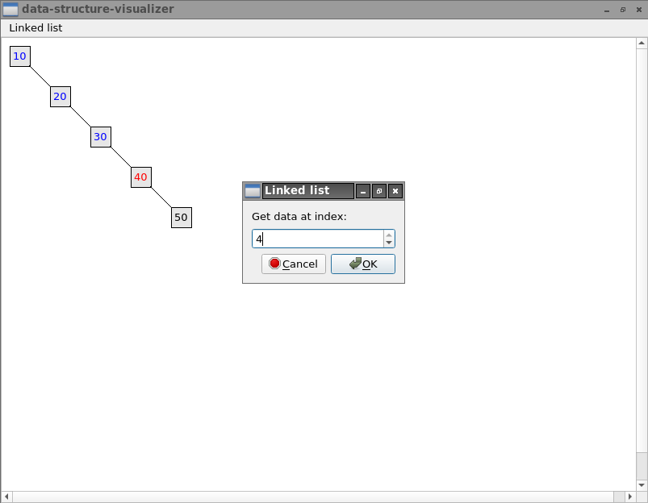

# data-structures-visualizer



User interface to create, edit and visualize programming data structures.
The project uses the libraries created through the following project:
https://github.com/jean553/c-data-structures

## Install and compile sub-module

Download the submodule (C data structures libraries):

```sh
git submodule init
git submodule update
```

Compile the libraries:

```sh
mkdir c-data-structures/build && cd c-data-structures/build
cmake ..
make
```

## Compilation

```sh
qmake
make
```

## Execution

```sh
./debug/data-structures-visualizer
```
